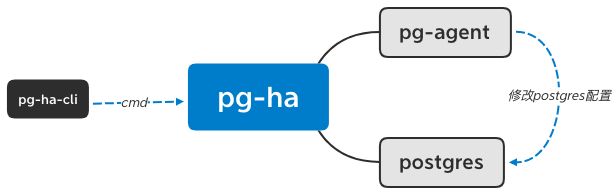

#Postgresql HA
## 概览
两台机器部署postgresql，以HA方式启动，一台为主，另一台为辅；当主宕机，辅会变成单机运行；当主再次启动，恢复原来的主辅关系

## 结构
* PG-HA由四部分组成
  * pg-ha-cli：向pg-ha发命令，切换postgres模式
    * -c 命令，支持start_ha、master_down、master_up
    * -m 主的ip
    * -s 辅的ip
  * pg-ha：postgres ha控制端，负责切换postgres的运行模式
  * pg-agent：以docker方式启动，接受pg-ha的请求，修改postgres配置文件
  * postgres：以docker方式启动，镜像版本为12.3

## 部署和启动
* 部署：其中pg-agent与postgres两个容器需要共享一个目录，这样pg-agent才能修改postgres的配置，部署时需要pg-agent和postgres先启动，再启动pg-ha，然后使用pg-ha-cli发送start_ha，让postgres以HA模式运行

* pg-ha启动，连接pg-agent服务器，如果pg-agent未启动，则退出
* pg-ha启动后通过postgres运行进程的关键字（walsender/walreceiver），判断postgres的运行模式是否是HA模式
  * 如果运行的进程中没有这些关键字代表是单机启动，pg-ha会以单机模式运行postgres，即初始化postgresql.conf，删除standby.signal，启动postgres
  * 如果包含，则是HA模式
    * 如果当前postgres的角色是主，检查辅的运行状态和角色，
      * 如果辅在运行，且角色也是辅，且辅上一次接收到的命令是start_ha或者master_up，直接以主的方式运行postgres，即添加synchronous_standby_names配置到postgresql.conf，如果存在standby.signal就删除，再重启postgres
      * 否则，首先会初始化postgresql.conf和pg_ha.conf，然后同步主数据到辅，再以主的方式运行postgres
    * 如果当前postgres的角色是辅，检查主的运行状态，如果检测到了，需要等待主同步完成且运行后，如果没有检测到直接运行，辅的运行方式是先添加primary_conninfo信息到postgresql.conf，然后生成standby.signal标志性文件，标志性文件为空即可，表示postgres会以辅的方式运行，然后通过primary_conninfo信息连接主

## HA切换
* pg-ha运行后，可以通过pg-ha-cli的向pg-ha发命令，改变postgres的运行模式
* 如果是第一次启动或者两个postgres角色是单机，则使用pg-ha-cli向pg-ha发送start_ha命令
  * 当主收到start_ha命令时，首先会初始化postgresql.conf和pg_ha.conf，然后通过rsync同步主数据到辅，然后以主的方式运行postgres
  * 当辅收到start_ha命令时，需要等待主同步完成且运行后，再以辅的方式启动postgres
* 当主宕机后，通过pg-ha-cli向辅的pg-ha发送master_down，辅以单机模式运行postgres
* 当主再次启动
  * 通过pg-ha-cli向辅的pg-ha发送master_up，辅会先向主发送Shutdown关闭主，然后同步数据到主的数据库，同步完成后，再向主发送master_up，等待主启动，当主启动运行后，再以辅的方式启动
  * 当主收到master_up，首先会初始化postgresql.conf和pg_ha.conf，然后同步主数据到辅，然后以主的方式运行postgres